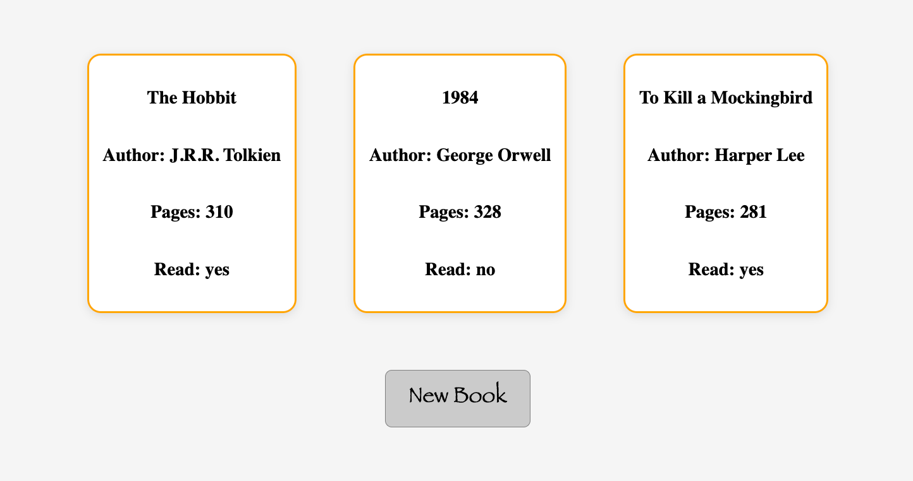
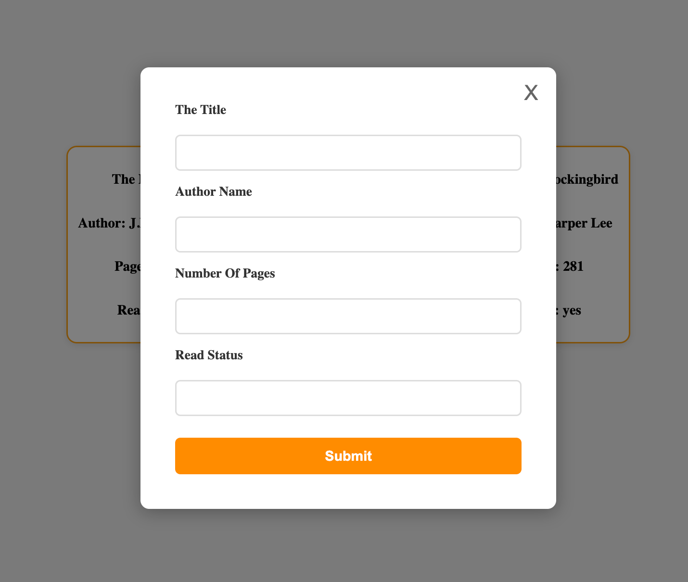

# Library

A simple library application to store and manage your book collection.

  
  

## Live Demo

[View Live Demo](https://thechosen-1.github.io/Library/)

## About

This project is part of my learning journey through [The Odin Project](https://www.theodinproject.com/) curriculum. It demonstrates fundamental JavaScript concepts including:

- Object constructors and prototypes
- DOM manipulation
- Event handling
- Dynamic content generation

## Features

- Add new books to your library
- Track book details (title, author, pages, read status)
- View all books in a clean card layout
- Popup form for easy book entry

## Technologies Used

- HTML5
- CSS3
- Vanilla JavaScript

## What I Learned

- Working with constructor functions to create book objects
- Managing data in arrays
- Creating and manipulating DOM elements dynamically
- Handling form submissions and user input
- Implementing popup/modal functionality

## The Odin Project

This project is part of [The Odin Project's JavaScript course](https://www.theodinproject.com/paths/full-stack-javascript/courses/javascript), focusing on organizing code with objects.
